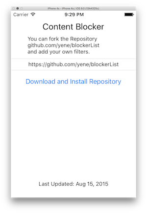

# Content Blocker for iOS
This app lets you use a github repository as the source for Safaris Content Blocker. Please fork [https://github.com/yene/blockerList](https://github.com/yene/blockerList) and add your own filters. Don't forget to enable the Content Blocker inside Safaris settings.

## Todo
- [X] on first run copy example blockerList from bundle to temporary
- [X] grab data from github repo
- [ ] check when updated last time
- [X] get all json files recursive
- [X] combine all json files
- [X] send json file to conten blocker 
- [ ] inform user that he has to toggle content blocker in settings
- [X] Write the data to shared folder
- [ ] remove duplicates in blockList
- [ ] add icons and artwork
- [ ] add blockerList as submodule
- [ ] Rename content blocker to something better

## Maybe Later
- [ ] inform user that there is an update in the github repo (notification?)
- [ ] add support for direct download of json and zip

## Questions
* Do i have to toggle the settings or is reload enough? calling reload is enough
* How do i find out if user enabled my content blocker?

## Links
* https://www.hackingwithswift.com/safari-content-blocking-ios9
* https://easylist.adblockplus.org/de/
* https://www.webkit.org/blog/3476/content-blockers-first-look/
* https://developer.apple.com/library/prerelease/ios/releasenotes/General/WhatsNewInSafari/Articles/Safari_9.html
* https://developer.apple.com/videos/wwdc/2015/?id=511